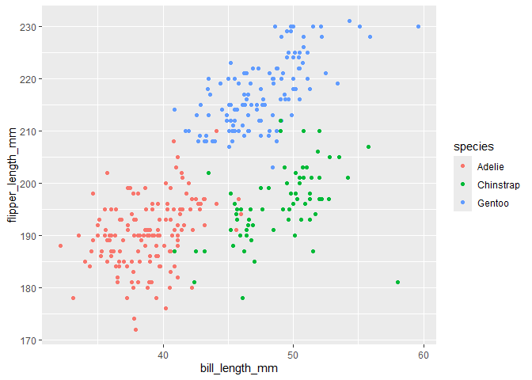

p8105_hw1_jz3902
================
Jinghan Zhao
2024-09-21

This is HW1 of P8105.

## Problem 1

### Load the `penguins` dataset

``` r
data("penguins", package = "palmerpenguins")
```

### Description of the `penguins` dataset

**Variable names and values**

Here are variable names and the first few rows of them.

``` r
names(penguins)
```

    ## [1] "species"           "island"            "bill_length_mm"   
    ## [4] "bill_depth_mm"     "flipper_length_mm" "body_mass_g"      
    ## [7] "sex"               "year"

``` r
head(penguins)
```

    ## # A tibble: 6 × 8
    ##   species island    bill_length_mm bill_depth_mm flipper_length_mm body_mass_g
    ##   <fct>   <fct>              <dbl>         <dbl>             <int>       <int>
    ## 1 Adelie  Torgersen           39.1          18.7               181        3750
    ## 2 Adelie  Torgersen           39.5          17.4               186        3800
    ## 3 Adelie  Torgersen           40.3          18                 195        3250
    ## 4 Adelie  Torgersen           NA            NA                  NA          NA
    ## 5 Adelie  Torgersen           36.7          19.3               193        3450
    ## 6 Adelie  Torgersen           39.3          20.6               190        3650
    ## # ℹ 2 more variables: sex <fct>, year <int>

**Size of the dataset**

The dataset has 344 rows and 8 columns.

**The mean flipper length**

``` r
penguins %>% 
  pull(, flipper_length_mm) %>% 
  mean(, na.rm = FALSE)
```

    ## [1] 2008.029

**A scatterplot of flipper length VS bill length**

Firstly, remove rows containing missing values.

Then, draw and save the plot.

Y is flipper length (mm), X is bill length (mm), colored by species.

``` r
penguins %>% 
  drop_na() %>% 
  ggplot() +
  geom_point(
    aes(x = bill_length_mm, 
        y = flipper_length_mm, 
        color = species)
    )
```

<!-- -->

``` r
ggsave("scatterplot.png")
```

    ## Saving 7 x 5 in image

## Problem 2

### Create the data frame

The data frame is comprised of:

`norm_samp` : a random sample of size 10 from a standard normal
distribution.

`samp_g0` : a logical vector indicating whether elements of the sample
are greater than 0.

`vec_char` : a character vector of length 10.

`vec_factor` : a factor vector of length 10, with 3 different factor
“levels”.

``` r
df = 
  tibble(
    norm_samp = rnorm(n = 10),
    samp_g0 = norm_samp > 0,
    vec_char = sample(letters, 10, replace = TRUE),
    vec_factor = factor(
        sample(c("A", "B", "C"), 10, replace = TRUE)
        )
    )

df
```

    ## # A tibble: 10 × 4
    ##    norm_samp samp_g0 vec_char vec_factor
    ##        <dbl> <lgl>   <chr>    <fct>     
    ##  1   -0.984  FALSE   v        C         
    ##  2    0.0679 TRUE    n        A         
    ##  3   -1.17   FALSE   k        A         
    ##  4    0.732  TRUE    e        C         
    ##  5   -0.704  FALSE   h        B         
    ##  6    0.817  TRUE    g        A         
    ##  7   -1.30   FALSE   o        B         
    ##  8   -1.65   FALSE   w        B         
    ##  9    1.61   TRUE    u        A         
    ## 10    0.643  TRUE    g        B

### Calculate the mean of each variable

Calculate the mean with `pull()`.

**Mean of numeric sample**

``` r
df %>% 
  pull(norm_samp) %>% 
  mean()
```

    ## [1] -0.1939788

**Mean of logical vector**

``` r
df %>% 
  pull(samp_g0) %>% 
  mean()
```

    ## [1] 0.5

**Mean of character vector**

``` r
df %>% 
  pull(vec_char) %>% 
  mean()
```

    ## Warning in mean.default(.): argument is not numeric or logical: returning NA

    ## [1] NA

**Mean of factor vector**

``` r
df %>% 
  pull(vec_factor) %>% 
  mean()
```

    ## Warning in mean.default(.): argument is not numeric or logical: returning NA

    ## [1] NA

The mean can be computed on numeric sample and logical vector, but not
on character and factor vector.

### Convert variables to numeric

``` r
df %>% 
  pull(samp_g0) %>% 
  as.numeric()

df %>% 
  pull(vec_char) %>% 
  as.numeric()

df %>% 
  pull(vec_factor) %>% 
  as.numeric()
```

By converting to numeric, the mean can be calculated for logical and
factor variables, but not for character variables.

**Discussion:**

The logical variables can be converted to numeric as value 0 or 1, so
the mean can be calculated.

The character variables cannot be converted to numeric, and the mean
cannot be calculated.

The factor variables can be converted to numeric values, but the mean
cannot be calculated. Calculating the mean of factor variables may not
be of practical significance, and the factor “levels” should not be
analyzed by simple addition and subtraction operations.
